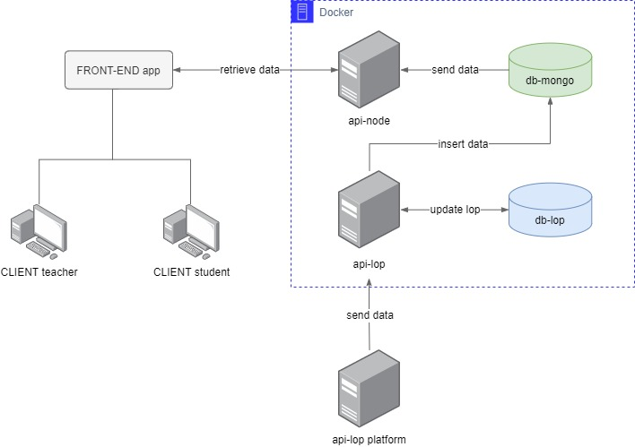

# Versão de Developer do DATAVIEWER

<!--
## Conceitos
Algumas observações do Docker Compose
- Uma vez que determinado parâmetro tenha sido comentado, ele só será comentado novamente caso apresente alguma particularidade
- Caso o sistema precise ser instalado em uma nova máquina, será necessário revisitar o [Tutorial da Digital Ocean](https://www.digitalocean.com/community/tutorials/how-to-secure-a-containerized-node-js-application-with-nginx-let-s-encrypt-and-docker-compose) para garantir o funcionamento do nginx e do certbot.
 -->

## 1. Visão geral

Esta branch contém os arquivos necessários para rodar a versão atual de desenvolvimento do Dataviewer. Neste README, você encontrará uma explicação de como estão organizados os containers do Dataviewer e os procedimentos para rodá-lo de forma localmente.

## 2. Containers

O *docker-compose.yml* possui containers relacionados ao frontend e ao backend do sistema em questão. Abaixo uma representação de como a arquitetura do Dataviewer foi montado a partir desses containers.



## 2.1. Frontend

### app

Container utilizado para administrar o front. O front fará requests para as API's as quais retornarão arquivos *.json* no intuito de formar as páginas do front.

Por enquanto ele não funciona porque não tem uma conexão com as API's feitas, ele ainda está conectado só com a api do natalnet que não funciona. Ainda está sendo organizada a conexão do front com as API's dos containers. Será acessado por [http://localhost:3000/](http://localhost:3000/)

## 2.2. Backend

### api-lop

Contem a API REST do LOP encontrada em [API Dataviewer](https://lop.api.dataviewer.natalnet.br/).

Nesse site, que é o oficial, ela não está funcionando: ao fazer requisições ao DB, é retornado *Internal Server Error*. Por outro lado, no nosso container de desenvolvimento, ao configurar o container com o DB, ela funciona tranquilamente. Acesse-a localmente por [http://localhost:5000/](http://localhost:5050/)
  
<!-- 
### api-users

Por estar em desenvolvimento, a API deste container não retorna nada. Para fazer este container ser criado, basta adicioná-lo com 

```compose
api-users:
    build:
      context: . 
      dockerfile: ./container-api-users/Dockerfile 
    container_name: container-api-users  
    depends_on: 
      - db-lop 
    ports:
      - "5050:5050"
    networks:
      - backend
```

Podemos futuramente acessar ele por [http://localhost:5050/](http://localhost:5000/) -->

### api-node

Contem a API desenvolvida em NodeJS encontrada em [http://localhost:3333/](http://localhost:3333/) que contem os seguintes serviços

> **GET /** <br> retorna a tela de login do Dataviewer 

> **GET /users/:id** <br> retorna o email, _id e nome do usuário pelo identificador

> **POST /users/auth** <br> autentica o usuário após ele clicar no botão Entrar com o Google 

> **GET /graphs/:id_class** <br> retorna os gráficos relacionados à uma classe (turma)

> **GET /classes/:id_teacher** <br> retorna as classes (turmas) de um professor

A arquitetura utilizada para a implementação do código foi a MVC (Model View Controller): o client faz uma requisição para a camada de Controller, o Controller aplica a regra de negócio (Services) nesta requisição, a camada de Services interage com as entidades do banco de dados a partir do mapeamento delas por meio do Model, o Model envia um response desses dados para o Controller que por sua vez retorna-os para o client por meio de uma interface, a View.  

### db-lop

Container onde criamos um banco de dados PostgreSQL para ser conectado com o sistema.  Ele é criado vazio sem nenhum dado, então para adicionar os dados a serem consumidos nas apis, temos que adicionar uma cópia do nosso db nele por meio do restore (próximo tópico).

A interface gráfica de gerenciamento de banco de dados do PostgreSQL é feita em um outro container chamado *pgadmin-compose*, que não existirá nos arquivos de produção pois é apenas uma forma de manusearmos o postgres com mais facilidade. Conseguimos acessar ele por [http://localhost:15432/](http://localhost:15432/). Utilizando essa interface conseguimos criar um server e também criar nosso db com base numa cópia que o desenvolvedor tem acesso.

### mongo

Container onde está o banco de dados central do sistema. A API NODE vai interagir o tempo todo com ele para poder retornar dados para o frontend. A interface gráfica de gerenciamento de banco de dados do MongoDB pode ser acessada por [http://localhost:8081/](http://localhost:8081/) com as credenciais apresentadas no tópico 3.2

## 3. Rodando o serviço

### 3.1. Preparando o ambiente

Antes de rodar os serviços, é necessário o Docker instalado em sua maquina, caso não tenha pode baixar [aqui](https://www.docker.com/products/docker-desktop). Com ele instalado, siga os seguintes passos

Clone este repositório na sua maquina com

```bash
git clone https://github.com/Natalnet/api-dataviewer.git
```

Entre na pasta do repositório utilizando 

```bash
cd api-dataviewer
```

Alterne para a branch da Versão-Dev com o comando 

```bash 
git checkout Versao-Dev
```

Suba os containers

```bash
docker-compose up -d
``` 

A primeira vez tende a demorar um pouco para fazer o build de todas as imagens

### 3.2. Autenticando-se

As rotas da API REST NodeJS usam o sistema de autenticação Sign In do Google. Tais rotas apenas poderão ser acessadas caso o client esteja logado com algum email institucional da UFRN (ufrn.edu.br, ufrn.edu).

Para os passos a seguir darem certo, é necessário duplicar o arquivo da pasta */container-api-node* chamado *.env.local*, renomeá-lo como *.env* e preencher os campos KEY_SECRET e CLIENT_ID, que são as credenciais da API do Google as quais permitem usar esse sistema de autenticação. Você pode obtê-las seguindo o guia [Integrating Google Sign-In into your web app](https://developers.google.com/identity/sign-in/web/sign-in) na parte *Create authorization credentials*

Para efetuar a autenticação é necessário acessar a rota [http://localhost:3333](http://localhost:3333) 

Clicar no botão Sign In e entrar com seu email institucional

Feito isso, o token de acesso para as rotas desta API é armazenado na forma de cookie no navegador. Esse percurso é resumido no seguinte diagrama


Assim, a cada requisição que o *app front* fizer para a API, ele precisará recuperar este token no cookie do navegador e colocá-lo no header da requisição da seguinte forma

```javascript
const token = Cookies.get("APINJS_AUTH");

const response = await api.method("/resource_name", {
  headers: {
    "Authorization": `Bearer ${token}`
  }
});
```

### 3.3.  Preenchendo o PostgresSQL

Acesse [http://localhost:15432/](http://localhost:15432/) e utilize as credenciais

> **username:** postgres <br> **password:** postgres <br> **email:** postgres@email.com

Em Add New Server, crie um novo server com o nome de *Dataviewer* e, na aba Connection, no campo host colocamos *db_lop*. Em username e password, colocamos as mesmas credenciais anteriores. Clique em save para criar o servidor.

Com o botão direito na aba do menu esquerda do server criado, criamos um novo DB chamado *db-lop* em Database após passar o mouse em Create.

Para fazer o restore do banco de dados, clicamos com botão direito em cima do banco de dados e selecionamos o restore. Em file, damos o upload da cópia do db que os desenvolvedores tem disponivel. Após fazer seguir esses passos, ja da para ver o sistema funcionando acessando o front-end em [http://localhost:3000/](http://localhost:3000/).

### 3.2. MongoDB

Acesse a interface gráfica do MongoDB em [http://localhost:8081/](http://localhost:8081/) por meio dessas credenciais

> **username:** admin <br> **password:** mongodb

O banco de dados que você deverá visualizar está nomeado como *apinode*. Com o botão direito, clique em *view* e veja as entidades cadastradas nele.
